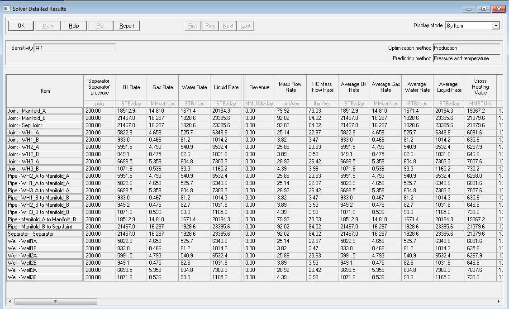
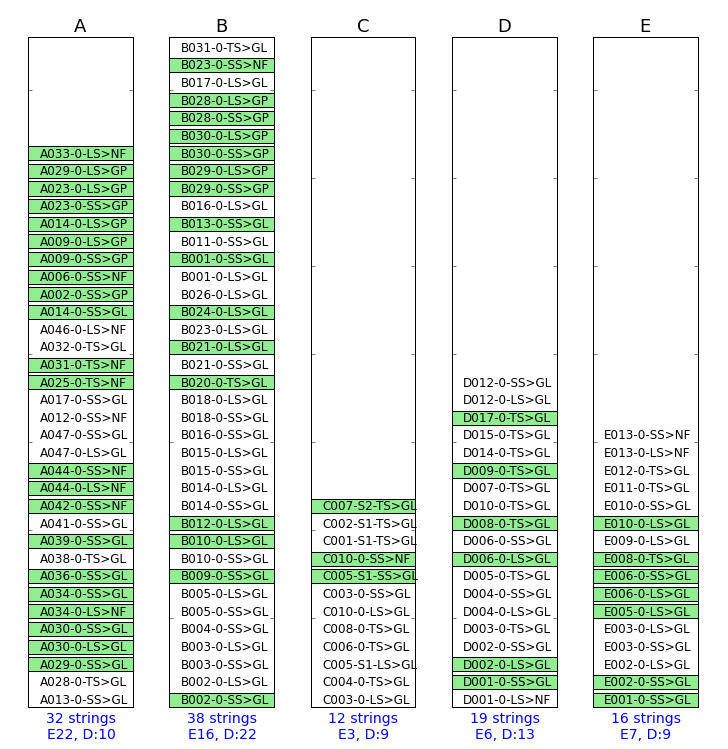
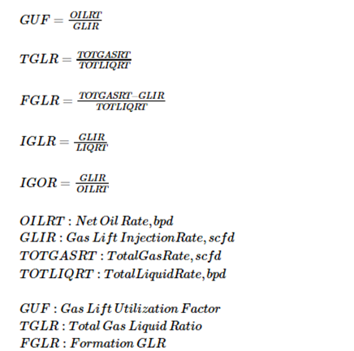
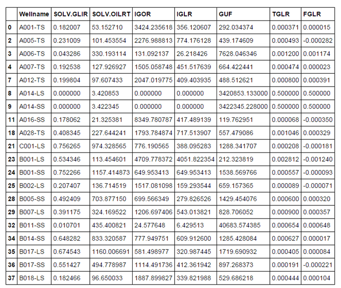
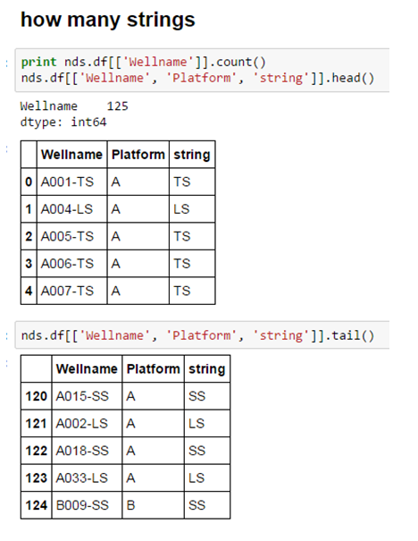

# Part 3: Data Science For Petroleum Production Engineers - The Well Network Dataset


## Introduction

In our last post ([Part 2](https://www.linkedin.com/pulse/data-science-petroleum-engineering-part-2-acquiring-alfonso-r-reyes?trk=mp-author-card)) we reviewed the multiwell dataset generated by scanning multiple well models built with the software **Prosper**. This time we will analyze a network model built with **GAP** - the well network analysis tool from Petroleum Experts -, using well models that have been previously calibrated and matched.

Typically, these network models are analyzed by viewing the built-in solver table and exporting the text data to any office application. This represents a little of an inconvenience because: (1) the results cannot be compared to other scenarios unless you take manual notes; (2) no graphical analysis can be directly performed because the application lacks plotting capabilities for the **solver** output; (3) the data that we need exported is not structured or tidy, -meaning, in no columnar format or something resembling tables or data frames. This requires time of the engineer for parsing and format the solution table in GAP to be understood by Excel or other analysis application; (4) lastly, the solutions are not saved in a historical file for future reference.

All of this is fine. We cannot expect from sophisticated state-of-the-art calculation engines to be full of features to satisfy the **data scientist i**n our production engineering office. We understand we are in a transition to an era where data analysis is king. We will get there soon. We expect that petroleum engineering software will catch up with the times over the years. In the meantime, we will handle or data analysis with **Python**, **R** or other data science tools available.

```Python
#
# is there a way to include Python code with this article
"""
Not only as pictures but in github

"""
i = 0
class MyClass:
    def __init__(self):
        self.var = 1
        
```


## The need of a dataset for well network models

As we mentioned earlier, the export mechanism for the calculation results is non-structured text but still it can be printed or pasted directly to Excel for parsing and separating the data in columns (**variables**) and rows (**observations**). In some way, this is time consuming and a potential source of errors. Worse if several iterations have to be performed on the input data for the generation of **optimization** scenarios. Certainly, this process is awaiting to be automated.

This is what is about: generating a custom script to read the network model from the original source or calculation engine: GAP. GAP, the network application from Petroleum Experts, comes with a very powerful interface for data interchange; it is called **OpenServer**.

With OpenServer it is possible to read and write variables from and to the network model file. Also allows the production engineer to customize production optimization scenarios in the most complex fashion making possible an automated process by means of iterative input to find a solution that better adapts to the conditions of our field. In this paper we will dedicate our attention to the GAP Solver that looks like Figure 1.



*Figure 1 - GAP solver panel from one of the examples.*


## The network model dataset

Instinctively, we may tempted to say, after seeing the solver table, that the dataset should be just the calculated columns in that table. But that would be an incomplete dataset. Besides of the solution for the scenario proposed, we require additional data for the network of wells under analysis.


`what is the additional data?`


## Gathering the data

Collecting the data for the network model is not a major problem; most of the data is coming from the well models that we saw in Part 2. At this stage, the well models have been matched to their **IPR** (inflow performance relationship), VLP**(vertical lift performance) and calibrated against their latest well test and FGS (flowing gradient surveys).

Additional data for the network model such as constraints, wells on-line, choke orifice size, flowline dimensions, separator pressures, total field production are entered directly in the model in GAP.

`what else?`


## The field view

During the construction of the network model, conditions change: wells that are on-line, wells shut-in, compressors down, flowlines opened or close or bypassed, changes in the chokes, back-pressure, etc. When we run the network optimization we are looking for a way to visualize in one plot the current status as is in the model file in GAP. This saves considerable time in navigating through screens and checking the well condition one by one.

What we see in *Figure 2* is a customized plot that was written using matplotlib, a Python plotting library. The variables shown are the minimal that could be shown as critical for the verification of the model. 

`change this plot to a neutral dataset`



*Figure 2 - The well network summary plot.*

Each of the rectangles represent a platform. The wells in green are the ones active or producing. The well with suffix NF, GP and GL mean that that well is a natural flow well or it is a gas producer or it is a gas lift well. At the bottom of the rectangles we see the total number of strings (or wells). The letter “E” below means the number of wells that are enabled in the model, while “D” indicates how many wells were disabled in the network model.

`change the plot above to something neutral`


## The KPIs dataset for Gas Lift

Since most of the wells in the dataset were producing with gas lift, In order to find relationships between the different gas lift parameters we build an additional dataset based on common gas lift formulas in Figure 3 to evaluate the gas lift performance of the field. The new dataset uses as a base for the calculations the columns available in the solver dataset.



*Figure 3: Key Performance Indicators (KPIs) for gas lift*


The reason for doing this is to observe the gas lift indicators under the light of the solutions recommended by the network optimizer. We try to find out if there is a better scenario that just maximizing the oil production, such as reallocating gas or give preference to wells with a lower watercut.

This is how the gas lift KPIs dataset looks after applying the formulas.



Figure 4 - a dataset generated from the solver solution.

`change figure to neutral`

Note that we have kept the well name as a column to identify the row or observation.


## Other datasets

`mention what are the other datasets that will be published`


## Basic statistics








## Advanced statistics








## Conclusions


- There is always a way to get an engineering solution to be statistically analyzed.
- Use plots to visualize a summary of the data.
- Don't be timid at generating additional datasets from the solution data.
- Look at what the plots tell you. They always will try to convey something.
- You are not wrong if you underestimate Excel as a potting tool. Look outside for better plotting tools but manage first how to get the data out.
- There is more gains to be made by analyzing your solution outside your favorite engineering software. There is no such thing as a software that does everything for everyone".


